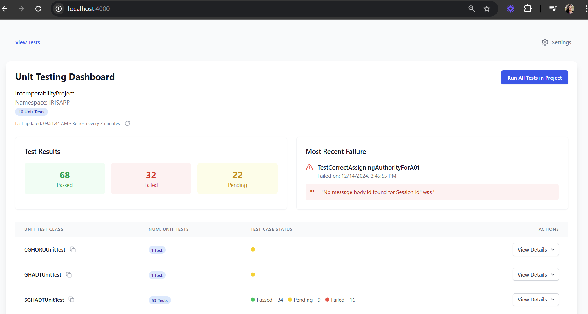

## iris-unit-test-dashboard

A Dashboard and API for returning Unit Test class and Test Results for an IRIS Interoperability Project 

## Contributors

* [Chi Nguyen-Rettig (LEAD North)-Backend & API](https://community.intersystems.com/user/chi-nguyen-rettig)
* [Shawntelle Madison-Coker (LEAD North)-User Interface](https://community.intersystems.com/user/shawntelle-madison-coker) 
* [Andre Ribera (LEAD North)-Interoperability](https://community.intersystems.com/user/andre-ribera)

## Inspiration
[Ideas Portal: Testing Dashboard for InterSystems IRIS](https://ideas.intersystems.com/ideas/DPI-I-441)
InterSystems interoperability projects involve testing routing and transformation pipelines in a namespace production. 
Packaging automated unit tests for integrations is possible using the %UnitTest class and the Unit Test dashboard from the 
System Management portal provides visibility into the results, but the Unit Test manager and Test Suite framework presents challenges to implementers due to lack of interoperability samples. 

The goal of the iris-unit-test-dashboard is to create a user-friendly and top-view dashboard for implementers to track the status of unit test development for a collection of feeds in an implementation project. 

## What it does
This repository contains an IRIS for Health instance with a namespace (IRISAPP) that contains an example directory structure to organize Unit Tests by Project Name, Namespace, and Unit Tests that contain methods for verifying simple HL7 integrations. The provided APIs provide visibility into the Unit Test classes and Test Cases for each class as well as the results of running the Unit Tests. An API to run the Unit Tests with a single command allows for push button execution of unit tests without needing to drill down to IRIS Terminal to perform command line operations. 

<!--
It uses [swagger-ui](https://openexchange.intersystems.com/package/iris-web-swagger-ui) module to provide documentation and test environment for API.
-->

# Getting Started

## Installation with Docker 

## Prerequisites
Make sure you have [git](https://git-scm.com/book/en/v2/Getting-Started-Installing-Git) and [Docker desktop](https://www.docker.com/products/docker-desktop) installed.


Clone/git pull the repo into any local directory e.g. like it is shown below:

```bash
$ git clone git@github.com:LEADNorthLLC/iris-unit-test-dashboard.git/
```

Open the terminal in this directory and run:

```bash
$ docker-compose up -d --build
```

## Management portal: 

The management portal is available at: 
[Management portal](http://localhost:62773/csp/sys/UtilHome.csp)

```bash
Login: _system/SYS
```

## API URLs

To fetch the demonstration tests: [Demonstration Tests URL](http://localhost:62773/csp/unittest/service)
To fetch the demonstration test results: [Demonstration Test Results URL](http://localhost:62773/csp/unittest/service/results)
To run all the tests Production: [Run All Tests URL](http://localhost:62773/csp/unittest/service/runtest)
To run all the tests Production(asynchronous/nowait mode): [Run All Tests Async URL](http://localhost:62773/csp/unittest/service/runtestasync)

## How to Access the IRIS Terminal from Docker Terminal

Open Docker Terminal: 
```bash
docker exec -it iris-unit-test-dashboard-iris-1 bash
```

Then open IRIS terminal:
```bash
iris session IRIS
```

## IRIS Unit Test Dashboard User Interface:

The UI is served from a second container and is available after docker startup at: 

[IRIS Unit Test Dashboard URL](http://localhost:4000)



[IRIS Unit Test Dashboard Documentation](test-ui.md)

## Sample Interoperability Project
A sample HL7 integration has been provided in: `src\INTEROP\InteroperabilityProject`.

The code includes simple routing rules and DTL transformations along with Unit Test classes located in the `UnitTest` folder. 

The Unit Test classes are modifications based on an open source HL7 RuleSet testing library provided by Alex Woodward. 

## REST APIs - TESTING

**Postman Collection**
There is a Postman Collection located in the `testing` folder:

`testing\IRIS UnitTest Dashboard.postman_collection.json` 

## Built with
Using VSCode and ObjectScript plugin, IRIS for Health Community Edition in Docker, IRIS openapi API, React.

## Collaboration 
Any collaboration is very welcome! Fork and send Pull requests!

## 

